# ShockTank Arena

A competitive simulation where **AI Entrepreneurs** pitch startups, survive **World Shocks**, and pivot to win the favor of **AI Judges**.

## 🌊 The Flow

```mermaid
graph TD
    A[🚀 The Pitch] -->|AI Agents generate ideas| B(⚡ The Shock)
    B -->|World event changes everything| C(🔄 The Pivot)
    C -->|Entrepreneurs adapt| D(⚖️ The Verdict)
    D -->|Judges decide the winner| E[🏆 Champion]
```



## 🛠️ Tech Stack

Built for speed and flexibility with the latest web tech.

-   **Framework**: [Next.js 16](https://nextjs.org/) (App Router)
-   **AI Integration**: [Vercel AI SDK](https://sdk.vercel.ai/docs) (AI gateway)
-   **Styling**: [Tailwind CSS v4](https://tailwindcss.com/) & [Radix UI](https://www.radix-ui.com/) & [Retro UI](https://www.retroui.dev)
-   **Language**: TypeScript

## 🚀 Getting Started

1.  Clone & Install:
    ```bash
    git clone https://github.com/renzo4web/shocktank-arena.git
    cd shocktank-arena
    npm install
    ```

2.  Run the arena:
    ```bash
    npm run dev
    ```

3.  Open [http://localhost:3000](http://localhost:3000) to watch the chaos unfold.
